# Brick Breaker Game in C

This project was developed as an academic group project as part of undergraduate coursework, incorporating several novel gameplay features beyond traditional Brick Breaker implementations.

## Project Presentation

The image below shows the academic group project demonstration during coursework evaluation.

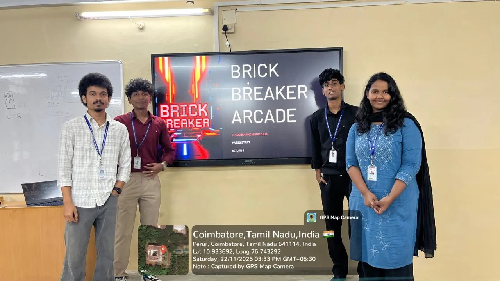

## Team Members
- Shirley.S (Team Lead)
- Teammate 1 Name
- Teammate 2 Name
- Teammate 3 Name

## Demo Video

A demonstration of the Brick Breaker game showcasing gameplay, Ghost Mode, color selection, and score-based feedback:

https://youtu.be/ZrtFob44jRs

## Screenshots & Feature Demonstration

### 1. Welcome Screen
The welcome screen loads successfully with the title, options, and stored high score.  
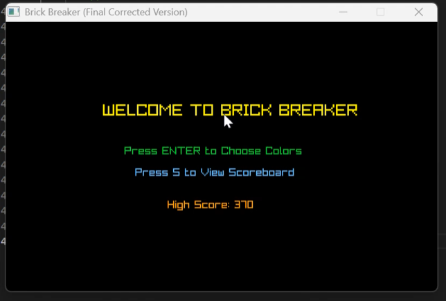

### 2. Early Gameplay (Score: 10)
Basic gameplay functions correctly with bricks, ball, paddle, and a rule-based feedback system.  
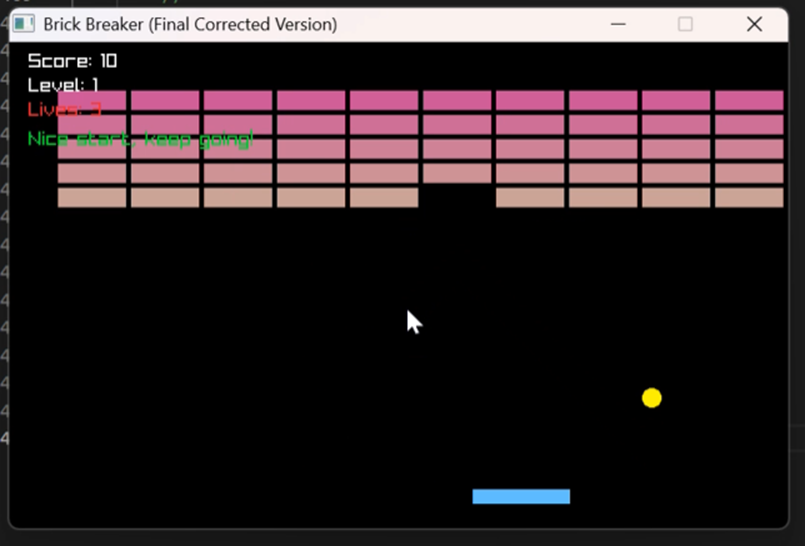

### 3. Gameplay (Score: 50)
Score updates accurately and the rule-based feedback changes according to player performance.  
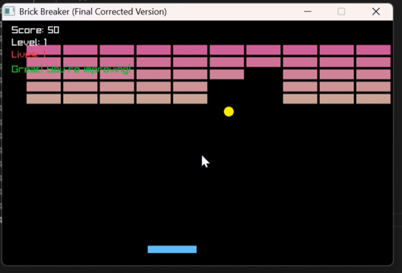

### 4. Ghost Mode Activated
Ghost mode triggers correctly and displays the white ball with the “GHOST MODE” indicator.  
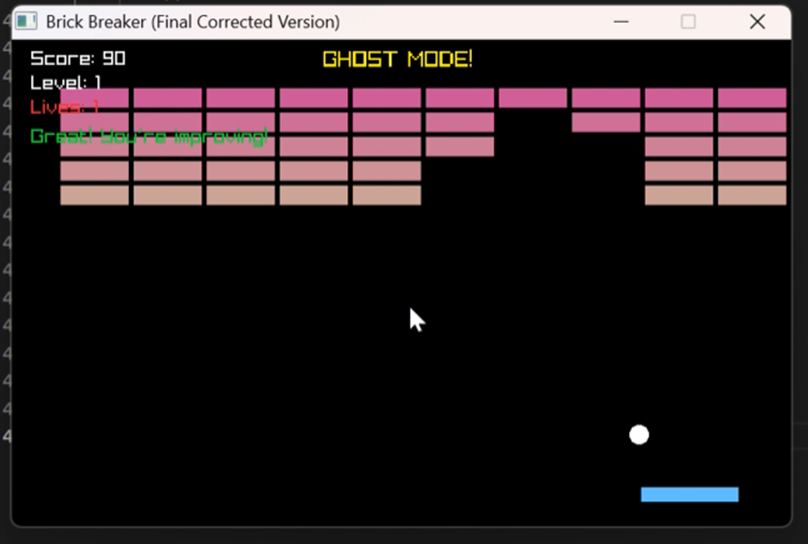

### 5. Higher Score (Score: 220)
Gameplay continues smoothly with accurate brick removal, scoring, and rule-based feedback.  
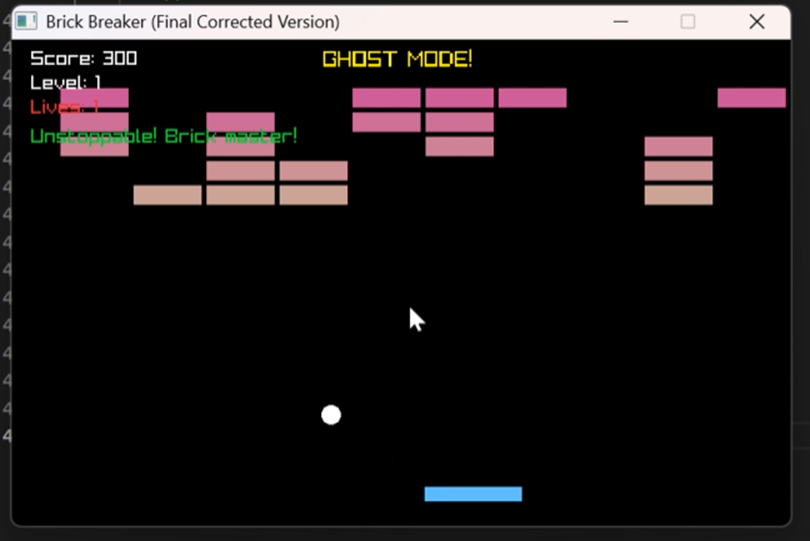

### 6. High Score Gameplay (Score: 300)
The game handles advanced scoring with ghost mode while maintaining stable performance and feedback.  
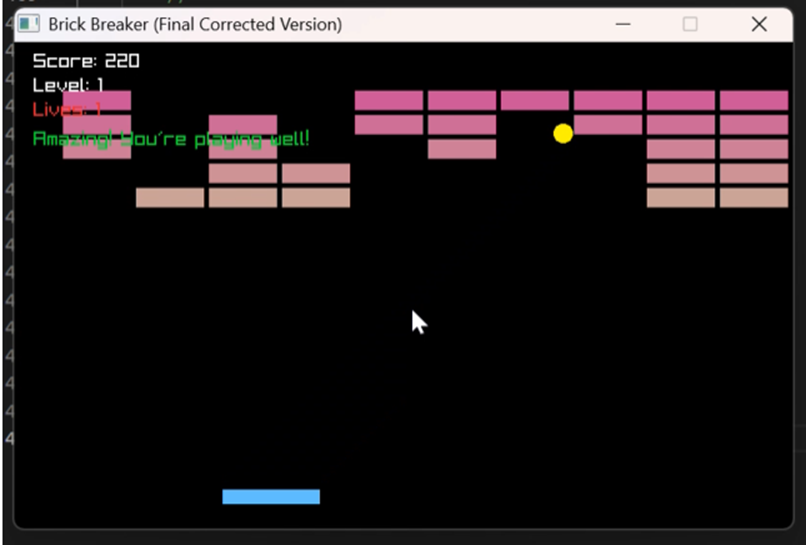

### 7. Game Over – New High Score
The system detects a new high score and displays an appropriate rule-based congratulatory message.  
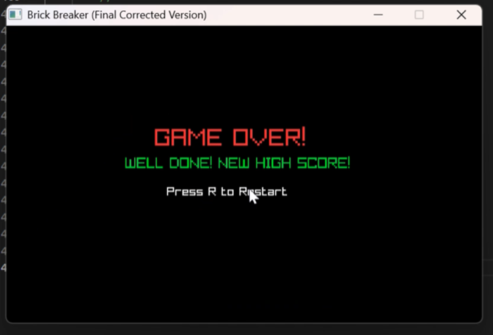

### 8. Game Over – Try Again Message
The game over screen displays a rule-based motivational message when no high score is achieved.  
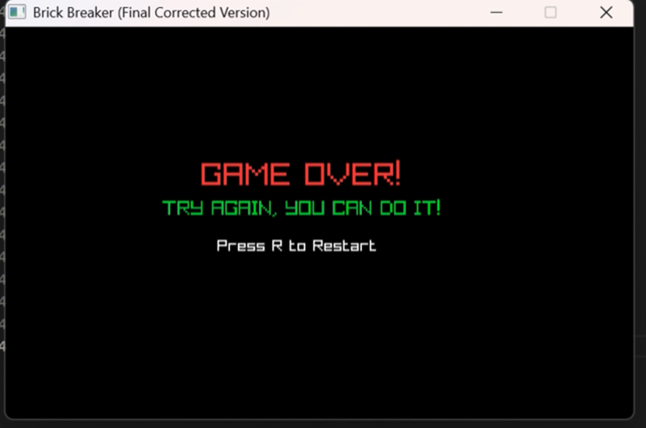

### 9. Color Selection Screen
Color selection options display properly and allow the player to customize the game.  

### 10. Gameplay With Custom Colors
Selected ball and paddle colors appear correctly during gameplay.  
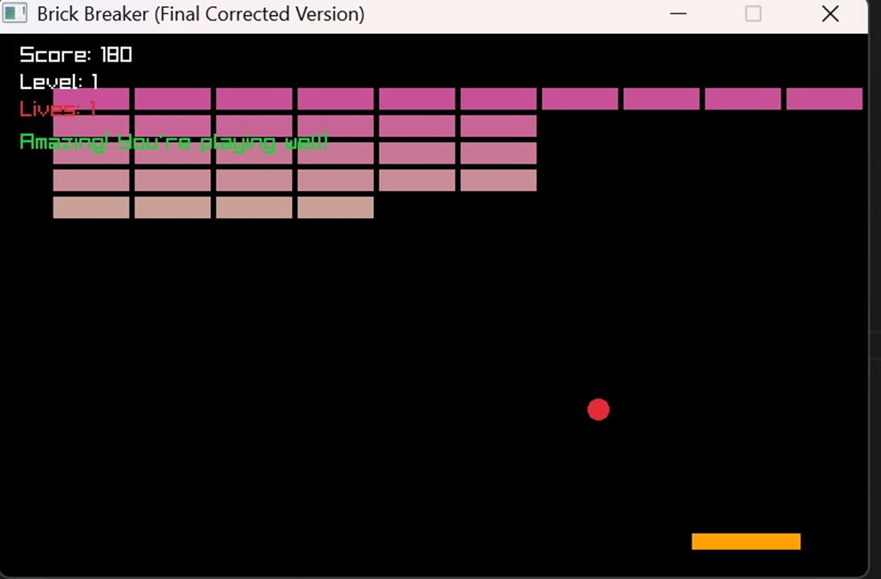

### 11. Scoreboard Screen
Top five scores are read from the file, sorted, and displayed accurately.  
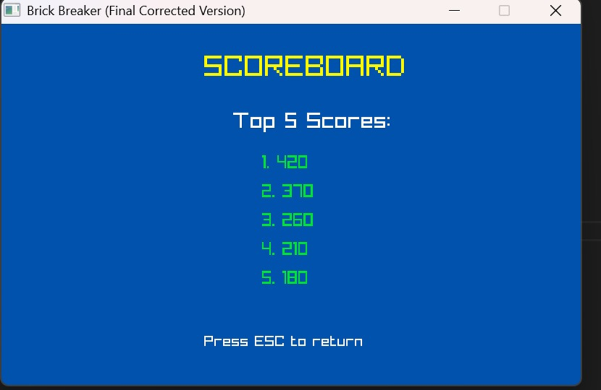
